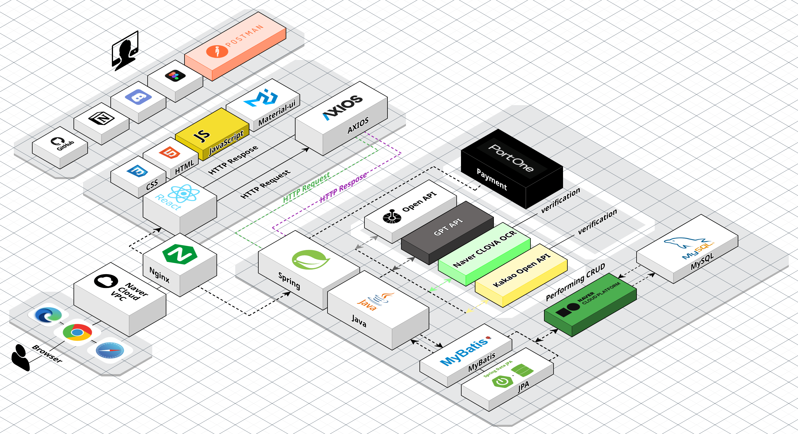

# AMADDA: Your Personalized Local Restaurant Tracker

**AMADDA** is a user-friendly web platform designed to help users pin, track, and manage their favorite local restaurants. The platform provides an intuitive interface for users to share restaurant experiences through personalized diary-like posts and discover posts curated based on real-time weather data.

---

## **Core Features**

### 1. **Local Restaurant Pin Management & Sharing**
- Pin your favorite local restaurants and manage them visually.
- Pin count dynamically updates the visual representation of the map.
- Generate shareable links and integrate with popular social media platforms.

### 2. **Diary-Style Posts for Each Restaurant**
#### 2.1. **Post Composition**
- **Diary Format**: Record personal experiences, feelings, and reviews for pinned restaurants.
- **Included Details**:
  - **Photos**: Upload images of food and ambiance.
  - **Weather Information**: Automatically recorded to reflect conditions during the visit.
  - **Visit Date**: Logs the date for easy tracking.
  - **Menu Details**: Save specific dishes and customize the experience.
  - **Emotions and Reflections**: Store memories and impressions for later.

#### 2.2. **Post Visibility Options**
- **Public**: Accessible to all users.
- **Private**: Monetizable by allowing others to unlock posts with site currency.
- **Personal**: Restricted to the author.

### 3. **Additional Features**
#### 3.1. **Food Calendar**
- Automatically logs diary entries into a calendar for easy viewing of visit history.
- Integrates seamlessly with recorded data.

#### 3.2. **Revisit Alerts**
- Sends reminders after a set time, encouraging users to revisit favorite places.

#### 3.3. **Revisit Scheduling**
- Drag-and-drop feature to set revisit schedules via the calendar.

#### 3.4. **Weather-Based Food Recommendations**
- Suggests diary posts and restaurant recommendations based on real-time weather.

#### 3.5. **Authenticity Verification**
- Allows users to upload receipts to validate their restaurant visits.

#### 3.6. **User Activity-Based Rewards**
- Ranks users by activity (pins, reviews, posts) and awards badges for milestones.

---

## **How AMADDA Works**

AMADDA utilizes a robust full-stack architecture that ensures seamless performance and user experience. Below is a summary of the key technologies and workflow:

### **Frontend**
- Built with **React**, styled using **Material-UI**, and managed with **JavaScript** and **CSS**.
- **Axios** handles HTTP requests, ensuring smooth API communication.
- Real-time **weather integration** enriches user posts with contextual data.

### **Backend**
- Powered by **Spring Boot** for RESTful services and business logic.
- Uses **MyBatis** and **JPA** for database interaction.
- **JWT** ensures secure user authentication.

### **Database**
- **MySQL** stores and organizes user data, pins, and diary posts.
- Supports CRUD operations efficiently.

### **Deployment**
- Hosted on **Naver Cloud Platform** with **VPC** and **Nginx** ensuring a secure and scalable environment.

### **Collaboration**
- Managed via **GitHub** with clear branching (main, develop, feature) for teamwork.
- Supported by **Postman** for API testing and **Notion** for documentation.

---

## **Repository Links**

- **Frontend**: [AMADDA Frontend Repository](https://github.com/JuniorSubSub-s/AMADDA-PROJECT/tree/main)
- **Backend**: [AMADDA Backend Repository](https://github.com/JuniorSubSub-s/AMADDA-PROJECT-BACK)

---

## **Live Deployment**

- **Website**: [AMADDA Live Platform](https://amadda.kr/amadda)

> **Note**: The live deployment will be available until **November 29, 2024**.

---

## **Contact & Support**
For questions, suggestions, or contributions, please feel free to contact us through our repositories.
